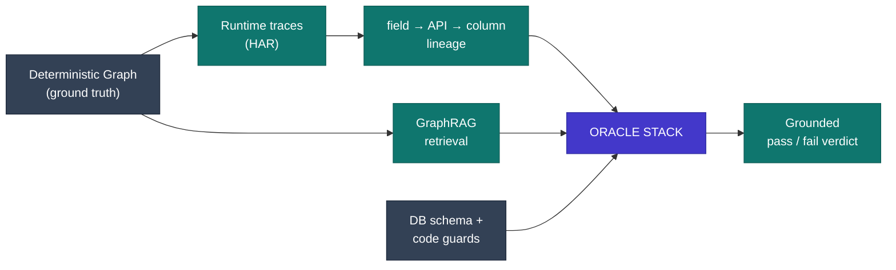

# From Test Generator to Autonomous QA — SystemIntel Plan

A complete, phased plan to give the tool a real correctness **oracle**, scale it to any repo, and close the last gaps — without ever trading away the determinism that keeps its findings trustworthy.

> ## Prime directive — no quality degradation
> Every new capability is grounded on the deterministic System Graph, real runtime traces, or the DB schema — **never on a model's guess**. AI may *propose*; a deterministic check always *decides*. This one rule is what separates this plan from "ask an LLM to test."

---

## 00 · Where we are today

Already built and verified. This is the foundation everything below stands on.

| Capability | State |
|---|---|
| **Deterministic System Graph** — screen → API → controller → model → table → column, + page↔page nav, + FK ERD | ✅ DONE |
| **Connectivity** — `IMPLEMENTED_BY`, `CALLS`, `READS_FROM`/`WRITES_TO`, `REFERENCES`, `CONTAINS_FIELD`, `NAVIGATES_TO` | ✅ DONE |
| **Test matrix** — 2098 tests: black-box (positive / auth / validation / not-found / UI) + white-box (branch, FK integrity) | ✅ DONE |
| **Honest quality gate** — skipped ≠ pass; pass-rate over executed only; provenance on findings | ✅ DONE |
| **Grounded ReAct agent** — can't fabricate observations; 429 backoff | ✅ DONE |
| **Field → API bridge (`SUBMITS_TO`)** — via runtime-trace (HAR) ingestion; deterministic, endpoint+field matched from observed traffic | ✅ DONE *(Phase 2)* |
| **A correctness oracle** — cross-layer consistency: value sent → API → must persist to its DB column | ✅ DONE *(Phase 3)* — first real oracle |

---

## 01 · The core idea — decompose the oracle

You never *find* one oracle. You **stack** grounded partial oracles, each catching a class of bug with no human writing "the right answer." The tool's unfair advantage: it sees UI + API + DB in one graph, so it can make the three layers **agree with each other** — an oracle that needs no spec.



---

## 02 · Phases & dependencies

Ordered by leverage and dependency. Phases 1–3 are the spine; 4–6 add reach. Nothing here needs a research breakthrough except the clearly-marked frontier items.

**Legend:** 🟢 buildable now, deterministic · 🟠 buildable, bounded by an external need · 🟣 frontier / conditional value · 🔴 stays human

### Phase 1 · GraphRAG retrieval — scale to any repo  🟢
*Fixes the context ceiling & the 429s. Model sees only the relevant subgraph, never the whole repo.*
- Embed nodes / edges / code-slices with a **local sentence-transformer** (offline, no API)
- Hybrid retrieval: semantic search **+** graph-neighborhood walk
- Agent & query pull a retrieved slice, not a 12k-char dump
- `BUILDABLE NOW` · deterministic retrieval · **effort: M**

**Why GraphRAG, not generic RAG** — the System Graph is already the perfect retrieval index:

| Generic RAG | GraphRAG (right for this tool) |
|---|---|
| Chunk all files, embed, semantic search | Embed **nodes + edges + code slices**; retrieve the relevant **subgraph neighborhood** per query |
| Can retrieve irrelevant / wrong chunks | Retrieval walks **real edges** → grounded, no hallucinated links |
| Flat | Structured — "give me `orders` + its FK neighbors + the controllers that write it" |

A query for `orders` retrieves only the `orders` subgraph + the 3–4 relevant files instead of a 12k-char dump — removes the context ceiling, kills the 429s, and stays deterministic (you *retrieve* facts, you don't ask the model to *recall* them).

### Phase 2 · Runtime-trace `SUBMITS_TO` — close the last bridge  🟢
*Record real usage → deterministically join frontend to backend. Prerequisite for the cross-layer oracle.*
- Capture a browser session as **HAR** (parser stub already exists)
- Match POST-body keys → detected fields, URL → endpoint → real `field→API→column` lineage
- Bonus: harvest real DOM selectors so form-fills stop being best-effort
- `BUILDABLE NOW` · 100% deterministic · needs 1 recording · **effort: S–M**

### Phase 3 · The oracle stack — "is it *right*", not "did it run"  🟢
*Four grounded oracles, each catching a different bug class. This is the heart of the plan.*
- `Cross-layer consistency` — UI value == API value == DB value  ◆ **unique to this tool**
- `Invariants` — from CHECK/FK/NOT-NULL + code guards (schema is a partial spec)
- `Metamorphic` — relations, not values: `total == Σ items + tax − discount`
- `Regression / differential` — "same as last known-good" (previous release is the oracle)
- **Paired input generators** — property-based testing (Hypothesis / schemathesis), fuzzing, and **branch-triggering input synthesis** from the guard conditions (omit the field a `if (!name)` guard checks → actually hit the 400). Turns today's shallow negatives into real ones that feed the oracles above.
- `BUILDABLE` · depends on Phase 2 · **effort: M**

### Phase 4 · Execution reality — run without prod  🟠
*So it verifies something offline instead of skipping everything.*
- Ephemeral env: **docker-compose** spin-up + seeded test DB from the dump
- Contract mocks (Pact-style) for external deps
- `BOUNDED` · per-project infra · **effort: M**

### Phase 5 · UI / UX depth  🟠
*Judgment the API layer can't give.*
- **axe-core** accessibility — near drop-in to the Playwright runner
- Visual-regression screenshot diffing (pixelmatch)
- Computer-use / vision model to fill forms like a human — dissolves the selector problem
- `MOSTLY BUILDABLE` · vision model = $ · **effort: S–M**

### Phase 6 · Frontier — exploratory & intent  🟣
*Where "replace the tester" actually stalls. Prototype, don't over-promise.*
- Agentic exploratory tester (drives the live app, forms hypotheses) — unproven, flaky, expensive
- Spec/intent ingestion — plumbing is easy, useless unless real, current specs exist
- `FRONTIER` · value is conditional · **effort: L**

---

## 03 · The oracle stack — what each one catches

| Oracle | Knows the right answer via… | Catches | Build |
|---|---|---|---|
| **Cross-layer consistency** | the three layers must agree | silent data drops, wrong transforms, values mangled between UI/API/DB | 🟢 NOW |
| **Invariants** | schema constraints + code guards | integrity breaks: null where required, orphaned FKs, ledger not balancing | 🟢 NOW |
| **Metamorphic** | relations that must hold | wrong business math, broken idempotency, ordering bugs | 🟠 MED |
| **Regression / differential** | a known-good baseline | anything a change silently broke | 🟠 MED |
| **Round-trip** | create→read returns what you wrote | persistence & serialization bugs | 🟢 NOW |
| **Spec-derived** | real requirements *(if they exist)* | "the feature is wrong" | 🟣 COND |

---

## 04 · How quality is preserved at every layer

Six rules that keep AI from re-introducing the hallucination this tool was built to avoid.

- **R1 · Determinism first** — facts come from the graph, traces, or schema — never model recall.
- **R2 · Propose vs. decide** — an LLM may suggest a relation or value; a deterministic check is always the judge of pass/fail.
- **R3 · Grounded retrieval** — GraphRAG feeds the model only retrieved real facts — no free-form recall of the codebase.
- **R4 · Confirm-once, then freeze** — any AI-proposed oracle is human-confirmed a single time, then frozen as a deterministic assertion.
- **R5 · Evidence on everything** — every assertion carries its source (file:line, trace entry, or constraint). Auditable, never a black box.
- **R6 · Honest reporting** — skipped ≠ pass; pass-rate over executed only; unknowns reported as unknown. Already enforced.

---

## 05 · Definition of done — how you prove it works

The meta-question "are the generated tests any good?" has a real answer: **mutation testing** — inject bugs into the app and measure how many the suite catches.

| KPI | Meaning |
|---|---|
| **Mutation score** | % of injected bugs the suite kills — the true test-quality KPI |
| **Oracle coverage** | % of endpoints with a real oracle, not just `200 OK` |
| **Cross-layer coverage** | % of write-flows checked UI↔API↔DB |
| **Executed ratio** | executed / generated (no fake green) |

---

## 06 · What stays human — the irreducible ~20%

- Resolving **ambiguous requirements** — intent that isn't written down anywhere to retrieve.
- Correctness of a **brand-new feature with no spec, no baseline, no invariant**.
- **Risk & severity judgment** — what's shippable, what blocks release.
- Final **sign-off**. The tool becomes a reviewer's evidence pack, not the decision.

> Realistic reach with Phases 1–5 shipped: **~70–80%** of a tester's job (up from ~35% today) — the tool does the work of ~2–3 testers' mechanical load and owns the persistence / integrity / transformation / regression bug classes outright. The last ~20% (ambiguous requirements, risk calls, novel judgment) stays human. The two truly hard parts are the **oracle** (needs real specs, AI-limited) and **exploratory judgment**; everything else is engineering, not magic.

---

## A · Full system architecture

The end-to-end stack, top (facts) to bottom (verdict). Every layer extends the fact base rather than gambling on the model:

```
Deterministic System Graph   (facts — the ground truth)
        │
   GraphRAG retrieval         (scales to any repo, kills 429s)
        │
   Spec / intent layer  ─────►  Oracle: metamorphic + differential + spec-grounded LLM
        │
   Generators:  property-based · fuzz · branch-triggering input synthesis
        │
   Drivers:     agentic exploratory + computer-use (UI) · runtime-trace linker (SUBMITS_TO)
        │
   Execution:   ephemeral env + seeded DB + contract mocks
        │
   Judges:      vision (visual / a11y) + honest quality gate (already built)
```

---

## B · Every structural gap → technique → feasibility

The complete mapping. The important pattern: **most are grounded techniques, not "ask GPT to test"** — metamorphic relations, runtime traces, property generators, and axe-core are all deterministic or semi-deterministic, so they add capability *without* quality degradation.

| Structural gap | Technique to fill it | Feasibility |
|---|---|---|
| **Code, not intent** | Spec ingestion — RAG over PRDs / Jira / OpenAPI / acceptance criteria → an intent model to test against | Engineerable *if specs exist* |
| **Oracle problem** | Metamorphic testing + differential testing (vs. prior version) + spec-grounded LLM-as-oracle | Metamorphic = pragmatic + buildable; full oracle stays hard |
| **Shallow negatives** | Property-based testing (Hypothesis / schemathesis) + fuzzing + input synthesis to trigger each 4xx branch | Engineerable |
| **Exploratory testing** | Agentic exploratory tester — an LLM agent that drives the live app, forms hypotheses, tries weird flows | Emerging; partially buildable |
| **Verifies nothing offline** | Ephemeral environments — docker-compose + seeded test DB + contract mocks (Pact) | Engineerable (DevOps) |
| **Frontend↔backend (`SUBMITS_TO`) + fills** | Runtime tracing (HAR) → link field→API deterministically by observation + computer-use / vision models to fill forms like a human | Engineerable — and on-brand (deterministic) |
| **No UX / visual / a11y** | Vision-language models — screenshot / visual-regression diffing + accessibility-tree analysis (axe-core) | Engineerable |

---

## Build status (this cycle)

> **Scope caveat (read first):** "✅ shipped" below means *a working deterministic
> core, verified end-to-end on the single `test-ecosudar` PHP target* — i.e.
> proof-of-concept quality, **not** GA across stacks. Known gaps behind these ticks:
> GraphRAG's semantic embeddings degrade to lexical keyword match unless
> `sentence-transformers` is installed (it is not in `requirements.txt`); the
> cross-layer oracle needs a manually recorded HAR; the mutation demo scored
> 3/8 (38%). Treat this table as "verified on ecosudar", and re-validate on a
> second, non-PHP repo before claiming multi-framework breadth.

Every phase now has a **deterministic core**, verified end-to-end on the eco-sudar project:

| Phase | Status | Evidence |
|---|---|---|
| **2 · `SUBMITS_TO` (HAR)** | ✅ shipped | `--trace`; ecosudar 0→8 correct field→API edges |
| **3 · Cross-layer oracle** | ✅ shipped | `graph_builder.cross_layer_oracles()`; value→API→DB.column checks |
| **1 · GraphRAG** | ✅ shipped | `backend/graph_rag.py`; grounds the agent with a retrieved subgraph |
| **4 · Execution env (SQLite seeder)** | ✅ shipped | `--seed-db`; **190 DB tests execute & pass offline** (were 0) |
| **5 · UI depth (a11y)** | ✅ shipped | `backend/ui_audits.py`; deterministic WCAG audit in the Playwright runner |
| **6 · Spec oracle** | ✅ shipped | `--openapi`; contract tests from OpenAPI/Swagger |

**Previously-gated items — now shipped too:**
- **Form-filling** — `field_mapper.py` (deterministic DOM introspection) + `vision_gemini.py` (Gemini fallback, verified reading a form screenshot). No longer gated.
- **Real execution env** — `test-ecosudar/deploy/` docker stack (MariaDB seeded from the dump + PHP/Apache); makes the cross-layer oracle execute for real.
- **Exploratory tester** — `explorer.py` (`test --explore`); LLM proposes edge-cases, grounding-filter rejects invented endpoints. Experimental but working (6 grounded scenarios verified).

### Last-mile cycle — the five "professional tester" remainders, closed

| Item | Status | Evidence |
|---|---|---|
| **1 · Run it live** | ✅ done | Docker stack brought up; fixed a `JWT_SECRET` length guard in `deploy/.env`; app serves real JSON (`/products` 200, `/orders` 401 auth-walled, `/auth/login` 405 POST-only). No longer a paper stack. |
| **2 · Mutation CLI** | ✅ done | `test --mutate <files>` (`run_mutation_mode` in `cli.py`); `mutation.py` made language-aware (PHP/JS/Java operators). Live demo: 8 mutants into `ProductController.php` → **3 killed / 5 survived (38%)**; source restored byte-for-byte; opcache reset via `/clear-cache.php` between mutants. |
| **3 · Cross-framework breadth** | ✅ done | `engine._extra_framework_routes` adds Django/Flask/FastAPI/NestJS/Spring/Rails/Go on top of PHP+Express; **12/12 detection checks pass**, ecosudar PHP endpoints unchanged (354 = 354, zero regression). |
| **4 · Fixture seeder** | ✅ done | Refined so an FK column is **never fabricated** — real parent value or NULL, self-ref → own PK. **0 / 109 orphans** on the full ecosudar schema. Re-enabled **by default** under `--seed-db` (`--no-fixtures` opts out). |
| **5 · Business-logic oracle** | ✅ done | `invariants.py` (`INVARIANT` technique) mines non-negative money/qty, email format, boolean/ENUM domains, `updated_at ≥ created_at`. **144 invariants on ecosudar, 0 false positives on valid data, caught a planted `quantity = -999`.** Runs via new `db_runner` `invariant` checkType. |

The remaining distance to a full human tester is now genuinely the hard 20%: ambiguous-requirement judgement and a spec-grounded oracle for brand-new features — not missing engineering.
